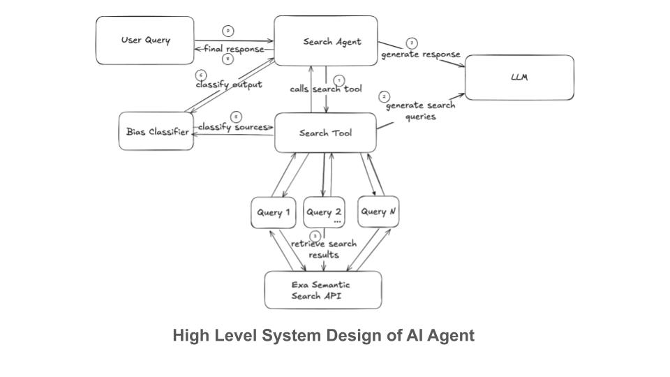
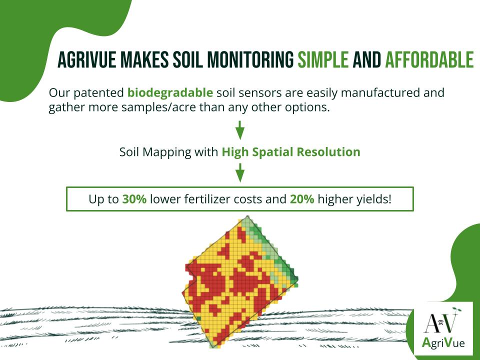
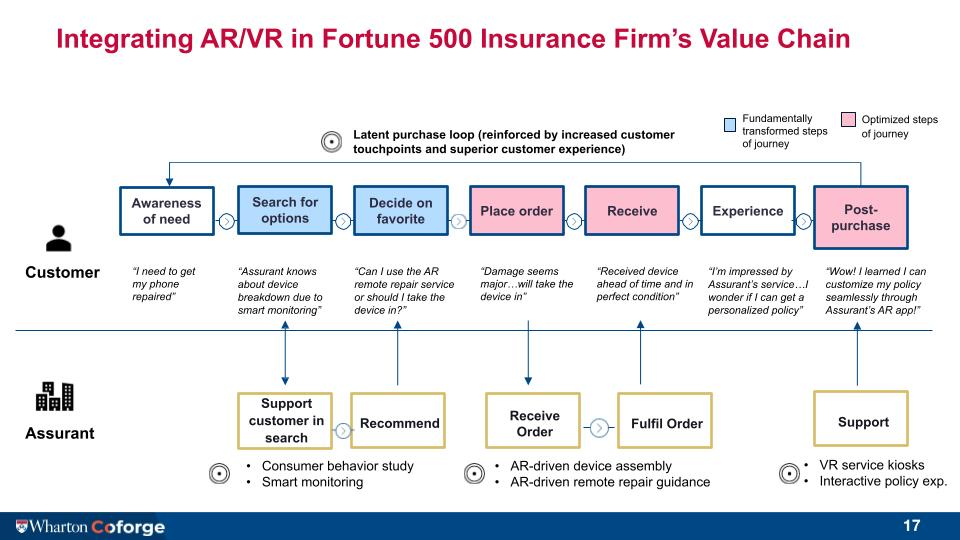

# Vani Kanoria: Data Scientist

I’m a Data Scientist passionate about **explainable machine learning, product strategy, and building AI that drives real-world impact**. My path started with a fascination for **mathematics** at Colgate University, where I first uncovered the power of data to reveal hidden patterns. That passion took me into the tech world, where I helped venture-backed startups harness data to shape product strategy, improve retention, and accelerate growth.

I recently completed my M.S.E. in Data Science at the University of Pennsylvania, where I deepened my expertise in machine learning, multimodal modeling, and AI for healthcare. Currently, I’m conducting research on how to integrate structured and unstructured clinical data using interpretable ML methods to improve patient outcomes.

Beyond research, I bring a unique perspective on innovation and high-growth businesses as an **Engineering Entrepreneurship Fellow**, where I partnered with founders and investors to evaluate startups and explore commercialization strategies for frontier technologies.

📬 Let’s connect: **vkanoria@seas.upenn.edu**

# Projects

### AI & Applied ML
- [AI-Powered Venture Sourcing: Recommender for Category-Defining Repositories](#category-defining-repos)
- [Multi-Modal Risk Prediction of Post-Surgical Hernia](#hernia-risk)
- [LLM-Powered Conversation Intelligence for Insurance Claims](#claims-messaging)
- [Bias-Resistant Search Agent](#bias-resistant-search-agent)
- [Music-to-Podcast Recommendation System](#podcast-rec-system)
- [Multi-Modal Models for Breast Cancer Classification](#multimodal-breast-cancer-classification)
- [Adapting Explainability Methods to Image Generation Models](#adapting-explainability-methods-to-image-generation-models)

### Classical Machine Learning
- [Forecasting Electricity Prices for New York Residential Sector](#electricity-price-forecasting)
- [Churn Prediction Model for  Sisense Customers](#churn-prediction-model-for-sisense)
- [Use Case Clustering for No-Code Platform <a href="https://www.unqork.com/" target="_blank">Unqork</a>](#workflow-use-case-clustering)
- [Loan Default Prediction Model](#loan-default) 

### Probability Modeling
- [Modeling Credit Card Usage using Negative Binomial Distributions](#modeling-credit-card-usage-using-negative-binomial-distributions)  
- [Generative Probability Models Capturing Trends in Ticket Sales of the Movie ‘Wonka’](#generative-probability-models-for-wonka-ticket-sales)  

### Data Analysis and Strategy
- [Data Strategy at Unqork](#data-strategy-template)
- [User Journey Analysis for Unqork Platform](#user-journey-analysis)
- [Decomposing Recent Protests in the US](#decomposing-recent-protests-in-the-us)  

### Business Strategy in Tech  
- [Talent Risk Intelligence Platform: A Solution for Semiconductor Supply Chains Issues](#crewiq)
- [End-to-End Business Plan for Biodegradable Soil Sensors](#business-plan-for-biodegradable-soil-sensors)  
- [Consulting Fortune 500 Insurance Company on Integrating AR/VR](#consulting-insurance-company-on-arvr-integration)  

## AI-Powered Venture Sourcing: Recommender for Category-Defining Repositories

**Objective:**  
- Prioritize GitHub repositories with the potential to become category-defining companies by combining interpretable signals with modern AI-driven recommendation pipelines.

**Methods:**  
- Built two complementary approaches:  
  - **Retriever + LLM Reranker:** Developed a **Category Defining Score (CDS)** from novelty, adoption velocity, commerciality, and community leadership; reranked with an LLM using few-shot prompting on structured metadata.  
  - **Weakly-Supervised Neural Recommender:** Trained a LightGBM teacher on Crunchbase-funded repos (weak labels), then distilled predictions into a student MLP capturing non-linear feature interactions.  
- Data enrichment included:  
  - **Embeddings & Novelty:** MiniLM embeddings of repo descriptions/tags; novelty scored as distance from incumbent leaders (Hugging Face, OpenAI, Databricks).  
  - **Adoption Metrics:** Stars, forks, and issues normalized by repo age.  
  - **Commerciality:** LLM scoring (0–5) from websites, descriptions, and repo metadata.  
  - **Community Leadership:** Contributors and dependency graph signals from Libraries.io.  
- Combined both models with **Reciprocal Rank Fusion (RRF)**, balancing interpretability and predictive power.  
- Evaluated via **bootstrap resampling** (stability) and **feature ablations** (importance of each pillar).

**Results:**  
- **Adoption velocity** and **novelty** were the strongest predictors; removing either reshuffled most of the top-20.  
- **Commercial intent** separated hobby repos from projects with company formation signals.  
- **Community leadership** had limited impact due to sparse dependency data, but is strategically important as graphs mature.  
- **Stability analysis:** Neural model showed Top-10 stability ≈ 0.62; CDS+LLM ≈ 0.28, making it better for exploratory picks.  
- **Hybrid modeling** outperformed single pipelines, with RRF balancing stability and discovery.

**Product Work:**  
- Defined roadmap for an **interactive investor dashboard** with LLM-powered explanations of why a repo is high-potential.  
- Outlined next steps: **semi-supervised scaling, graph-based dependency modeling, and pairwise LLM judgments** for more nuanced comparisons.

 
## Multi-Modal Models for Breast Cancer Classification
As a final project for my Deep Learning class, I worked with teammates Adwait Agashe, Renu Jadhav, and Uday Malhotra to introduce a multimodal deep learning framework that integrates mammogram imaging with textual clinical data, evaluates multiple combinations of vision and text-based architectures, and compares their performance with an image-only base model.	

**Objective:** 
- Develop a multimodal deep learning framework to enhance the accuracy of breast cancer diagnosis by integrating mammogram imaging data with clinical features.

**Methods:** 
- Utilized the CBIS-DDSM dataset, combining mammogram images with tabular clinical data for multimodal analysis.
- Explored multiple architectures:
	•	ResNet for image-only classification.
	•	Multimodal combinations of CLIP (image and text), BERT (text), ResNet (image), and Vision Transformers, or ViT (image).

**Results:**  
- Achieved 86.36% test accuracy with the BERT-ViT configuration, demonstrating a 25% improvement over the ResNet baseline.
- Demonstrated the potential of multimodal learning for breast cancer detection, combining complementary imaging and clinical features for better diagnostic support.

<a href="https://github.com/vanikanoria/MultiModalBreastCancerClassification" target="_blank">Github link</a>

  
## Churn Prediction Model for **<a href="https://www.sisense.com/" target="_blank">Sisense</a>**

In this internship project, I built two machine learning models to predict churn using features I developed from support and engineering tickets, customer call transcripts, product usage data and onboarding data. I achieved 94% test accuracy overall by combining the models.

**Objective:**  
- Develop machine learning models to predict customer churn for Sisense's client base.

**Methods:**  
- Collected and processed data from support/engineering tickets, Gong call transcripts, product usage metrics, and onboarding data.  
- Segmented customers by size and use case
- Engineered predictive features and built Random Forests model for each segment
- Add feature attribution using Shapley values, explaining to customer success which features are signalling high churn risk
- Designed user interface to optimize actionability

**Results:**  
- Achieved **94% test accuracy** by combining models.  
- Identified key churn drivers, enabling targeted customer success interventions.  

  
## Loan Default Prediction

In this project, I built and evaluated machine learning models to predict the risk of loan default using structured applicant and loan data for only 600 applicants. The project emphasized robust feature engineering, statistical rigor, and model interpretability.

**Objective:**  
- Build predictive models to assess likelihood of loan default and identify key financial, geographic, and demographic risk factors

**Methods:**  

- Conducted exploratory data analysis with statistical testing (Welch’s t-test, Kolmogorov–Smirnov, chi-square) to evaluate feature significance.
- Engineered financial ratios (e.g. payback power, rent-to-income), and segmented applicants by geography using zip codes and Metropolitan Statistical Areas (MSAs).
- Integrated an external macroeconomic dataset using zip code and MSA mappings to incorporate local features such as unemployment rates and housing market trends.
- Trained Logistic Regression, Random Forests, and Gradient Boosting models with hyperparameter tuning
- Used SHAP values and partial dependence plots to explain predictions and surface non-linear effects

**Results:**  

- Achieved an F1 score of 0.81 and AUC of 0.83 on the test set.
- Identified key drivers of default: FICO scores, number of payments, applicant age, and loan amount requested.
  

<a href="https://github.com/vanikanoria/CreditRiskAnalysis/blob/main/ZestAnalysis.ipynb" target="_blank">Github link</a>

## LLM-Powered Conversation Intelligence for Insurance Claims

**Objective:**  
- Transform unstructured claims communication into actionable insights to accelerate resolution and enable automation.

**Methods:**  
- Designed and implemented a **hybrid Regex–LLM intent classifier** to detect multiple intents in claimant and staff messages.  
- Built **OpenAI-powered summarization and subject generation** pipelines to provide concise overviews of message content.  
- Developed a **Streamlit dashboard** for claims adjusters to monitor KPIs, track trends, and drill down by message intent.  
- Created **metrics for strategic decision-making**, including volume trends, escalation rates, and conversation duration analysis.

**Product Work:**  
- Defined **product vision** for an **Automated Claim Communication Routing System** to route intents (e.g., scheduling, document requests, escalations) to the right workflows.  
- Outlined roadmap for **Data-as-a-Service API** providing JSON outputs with intent, summary, and subject for integration into claims platforms.  
- Proposed automation flows for common intents, reducing manual review time and improving SLA adherence.

**Results:**  
- Identified that 55%+ of claimant messages were scheduling or requests, highlighting automation opportunities.  
- Revealed message volume patterns to inform staffing forecasts and proactive communication strategies.  
- Demonstrated how **AI-driven triage** could reduce resolution time and surface high-priority escalations in real time.

<a href="https://claims-messages-to-routing-system-g2he5hargnw3avgnmrhwyk.streamlit.app/" target="_blank">Link to Streamlit App</a>

<a href="https://github.com/vanikanoria/Claims-Messages-to-Routing-System" target="_blank">Link to Github Repository</a>

### Multi-Modal Risk Prediction of Post-Surgical Hernia

As a Research Assistant at the Kording Lab at Penn Medicine, I worked on a project to predict hernia risk before, during, and after surgery by combining structured EHR data with clinical notes. The goal was to support clinical decision-making through interpretable machine learning methods.

**Objective:**  
Develop robust ML pipelines to assess post-surgical hernia risk at multiple stages of the surgical timeline by leveraging both structured and unstructured clinical data.

**Methods:**
- Built end-to-end modeling pipelines using structured EHR features (e.g., comorbidities, medications, procedures) and unstructured clinical notes.
- Extracted domain-specific features and confidence scores from clinical text using prompt engineering and OpenAI’s LLM API.
- Created clinical note embeddings for additional signal beyond engineered features.
- Applied tree-based models (e.g., XGBoost) and used SHAP values to provide feature-level explainability to clinicians.

**Results:**
- Produced accurate predictions of hernia risk across three key timepoints (pre-index, in-index, post-index), supporting proactive intervention planning.
- Demonstrated that integrating clinical notes significantly improved predictive performance over structured data alone.
- Delivered interpretable model outputs via SHAP to foster trust and transparency in model-aided clinical decisions.

## Bias-Resistant LLM Search Agent, Penn Engineering

**Objective:**  
- Reduce political bias in LLM-powered search results by filtering sources through a BERT-based political bias classifier.

**Methods:**  
- Built a **BERT-based bias detection model (PoliticalBiasBERT)** to score retrieved sources on ideological leaning.  
- Developed a **balanced sourcing pipeline** to filter sources and ensure ideologically diverse input to the LLM.  
- Enhanced classifier performance using **contrastive learning with ideological anchors** and **hierarchical attention transformers**.

**Results:**  
- Reduced output bias in LLM search agents through source filtering.  
- Demonstrated correlation between source bias and LLM output bias.  
- Improved classifier accuracy through advanced training techniques.  
- Enhanced neutrality of responses for end users.

<a href="https://github.com/PaulJKathmann/CIS6200-final-project/tree/main" target="_blank">Github link </a>

<a href="https://docs.google.com/presentation/d/1vlmMXWb2hmlin9D-JCwyScQPwCTtNL0uh4uK0eNWV3Q/edit?slide=id.g34de40b2420_0_5#slide=id.g34de40b2420_0_5" target="_blank">Link to slide deck </a>

## Music-to-Podcast Recommendation System
This project involved building a content-based recommendation system that connects users’ music preferences to curated podcast suggestions utilizing publicly available data from Spotify. The system extracts semantic themes from song lyrics and podcast metadata to provide personalized recommendations.

**Objective:**
To design a robust recommendation engine that bridges the gap between music and podcast consumption by analyzing content similarities, enhancing user discovery, and delivering high-quality recommendations.

**Methods:** 
- Feature Engineering: Generated embeddings for song lyrics and podcast descriptions using pre-trained NLP models (e.g., Sentence Transformers).
- Data Engineering: Stored embeddings in PostgreSQL with pgvector for fast similarity queries, integrating relational and vector-based data storage.
- Recommendation Algorithm: Developed a hybrid ranking mechanism combining vector similarity, keyword overlap, and popularity metrics.
- Application Development: Built a two-page web application:
	•	Page 1: Accepts a song input and displays podcast recommendations.
	•	Page 2: Provides insights into trends in the music and podcast dataset.

**Results:**
- Delivered highly relevant podcast recommendations based on user-provided songs with measurable improvements in thematic alignment.
- Successfully demonstrated the integration of advanced NLP techniques with vector databases for real-time recommendations.
- Created an intuitive interface showcasing both personalized recommendations and dataset insights, highlighting trends in audio content consumption.
 

## Adapting Explainability Methods to Image Generation Models

**Objective:**  
- Identify key tokens in text-to-image generation models, focusing on Stable Diffusion.  

**Methods:**  
- Adapted Shapley values (SHAP) to identify key tokens in text prompts.  
- Applied the framework to understand how input tokens influence generated images.  

**Results:**  
- Achieved **90% accuracy** in identifying key tokens.  
- Enhanced model transparency and interpretability for end-users.  
    

<a href="https://github.com/CalebG1/TrustworthyML/blob/main/Automating_SHAP_value_calculation.ipynb" target="_blank">Github link</a>

  
## Use Case Clustering for **<a href="https://www.unqork.com/" target="_blank">Unqork</a>**'s No-Code Workflow Development Feature

As a Product Data Analyst at **<a href="https://www.unqork.com/" target="_blank">Unqork</a>**, I quantified characteristics of applications created using Unqork’s software and applied clustering algorithms to categorize use cases, leading to a pivot in product strategy and saving 70% of engineering resources allocated.

**Objective:**  
- Analyze and categorize applications built using the workflow feature **<a href="https://www.unqork.com/" target="_blank">Unqork</a>**'s no-code platform to inform future product roadmap.

**Methods:**  
- Extracted key characteristics from applications.  
- Applied clustering algorithms to identify distinct use case categories.  

**Results:**  
- Optimized product strategy by focusing on key use cases.  
- Saved **70% of engineering resources** by prioritizing high-impact clusters.

  
## Electricity Price Forecasting for **New York Residential Sector**

In this project, I developed machine learning and time series models to forecast electricity prices in New York’s residential sector, achieving a MAPE of 3% on validation data. By incorporating weather data from Meteostat and macroeconomic data from FRED, I improved forecasting accuracy by 40% from the base model, achieving a MAPE of 1.8% on validation data.

**Objective:**  
- Predict monthly electricity prices using historical, weather and macroeconomic data to identify trends and enhance forecasting accuracy.

**Methods:**  
- Preprocessed historical electricity price data to address trends, seasonality, and outliers.  
- Integrated weather variables (temperature, precipitation) from the **Meteostat API** and macroeconomic variables such as Resident Population and Median Annual Income from **FRED** in New York as predictive features.  
- Built XGBoost regression model, optimizing parameters through grid search.  
- Evaluated model performance using MAPE or Mean Absolute Percentage Error.  

**Results:**  
- Achieved **3% MAPE** on validation data using only historical electricity prices and **1.8% MAPE** when incorporating weather and macroeconomic variables, a 40% improvement on the base model.  
- Demonstrated the significant impact of weather and macroeconomic data on electricity price forecasting, providing actionable insights for energy planners.  

<a href="https://github.com/vanikanoria/ElectricityPriceForecasting/tree/main" target="_blank">Github link</a>

  
## Explaining Medical Insurance Price Prediction Models

In this project I apply 4 different machine learning models (Linear Regression, Random Forests, Decision Tree Regressor and XGBoost Regressor) to predict charges on medical insurance based on demographic characteristics of the holds of insurance. I then utilize feature importance functions in sklearn and SHAP analysis to attribute feature importance of each model.

**Objective:**   
- Predict medical insurance charges based on demographic data and identify most optimal model in terms of the accuracy-interpretability tradeoff.  

**Methods:**  
- Applied four models: Linear Regression, Random Forest, Decision Tree Regressor, and XGBoost.  
- Used feature importance (scikit-learn) and SHAP analysis to interpret model outputs.  

**Results:**  
- Identified key factors influencing insurance costs (e.g., age, BMI, smoking status).  
- Improved model transparency, aiding in fair and explainable predictions.  

<a href="https://github.com/vanikanoria/Explaining-Medical-Insurance-Price-Prediction-Models/blob/main/Medical%20Insurance%20Price%20Prediction.ipynb" target="_blank">Github link</a>
  
 

  
## Modeling Credit Card Usage using Negative Binomial Distributions

How many credit cards do people in the United States own and why? This breakdown of the number of credit cards regularly used by different age groups sheds light on the preferred number of cards for different demographic groups, and may even provide hints about financial habits exhibited by them. 

**Objective:**  
- Analyzed patterns in credit card ownership to inform credit card strategy.  

**Methods:**  
- Applied Negative Binomial Distribution models to survey data.  
- Segmented data by age and demographic characteristics.  

**Results:**  
- Identified trends in credit card usage across demographics.  
- Provided insights into financial habits and credit preferences.

  

<a href= "https://docs.google.com/document/d/19pGHoWhPxMCa6Oa3IsEaXWJZjmh3kMTXBLWdWFak0HE/edit?usp=sharing" target="_blank">Link to paper</a>

  
## Capturing Behavioral Trends in Ticket Sales of the Movie ‘Wonka’

This paper examines the ticket sales of the movie Wonka in the three months after its release by applying time-series probability distributions and including time-varying covariates such as weekend and holiday effects. The 2-segment Weibull Distribution calibrated to the data captures the presence of two behavioral segments in the population with differing propensities to watch Wonka.

**Objective:**  
- Modeled ticket sale trends for the movie "Wonka" using probabilistic methods to learn about behavioral trends and factors influencing moviegoers.  

**Methods:**  
- Applied time-series probability distributions (e.g., Weibull Distribution).  
- Incorporated time-varying covariates (weekends, holidays) to capture sales patterns.  

**Results:**  
- Accurately captured dual behavioral segments in ticket sales.  
- Provided insights into movie-going trends and seasonal effects.
  

<a href= "https://docs.google.com/document/d/1-PKIqhM4UE7eD6I4BJn0yteaYdaPIJSlaMNlUWYxIjc/edit?usp=sharing" target="_blank">Link to paper</a>

  
## Data Strategy Template for [Unqork](https://www.unqork.com/) Feature Launches

As a Product Data Analyst at [Unqork](https://www.unqork.com/), I created a standardized data strategy template to streamline collaboration between Product Managers and Analysts, ensuring consistent, measurable, and actionable tracking for every feature launch.

**Objective:**  
- Establish a repeatable framework to define success metrics, data collection, and review processes for new feature launches.  
- Improve cross-functional efficiency and accountability in analytics-driven product decisions.  

**Methods:**  
- Designed a template covering:  
  - Feature overview and goals  
  - Clear definitions for ambiguous terms  
  - Key success metrics and mapping to adoption or productivity  
  - Baseline data and action plan for trend-based decisions  
  - Review timelines with assigned owners  
  - Execution steps including tracking setup, dashboards, and data engineering needs  

**Results:**  
- Enabled Product Managers and Analysts to collaborate efficiently and launch features with clearly defined metrics.  
- Increased consistency and speed of analytics processes, reducing ad-hoc discussions.  
- Strengthened a culture of **data-informed product decision-making**, adopted across multiple product lines.  

**Impact Stats:**  
- ⚡ Standardized process **reduced ad-hoc analytics discussions by 30%**  
- ⏱️ Improved feature launch efficiency, saving time for **multiple cross-functional teams**  
- 📊 Ensured measurable outcomes and follow-up, making **data-driven decision-making a repeatable practice**
  
**Video Walkthrough:** [Watch here](https://www.loom.com/share/058aae0483d543a1b48ce64eb1680a69?sid=49153b15-7ca3-49ba-855e-3f07f3206555)

  
## User Journey Analysis for **<a href="https://www.unqork.com/" target="_blank">Unqork</a>** Platform

As a Product Data Analyst at <a href="https://www.unqork.com/" target="_blank">Unqork</a>, I analyzed user behavior on Unqork's no-code platform during their first 30 days to optimize marketing trials and onboarding strategies.

**Objective:**  
- Leverage data to understand key engagement patterns of new users.
- Enhance trial design and onboarding processes to boost user engagement.
  
**Methods:**  
- Queried time-stamped user interactions in Snowflake, focusing on key actions such as module views, component creation, and advanced searches.
- Identified the first 5–10 actions new users take after their initial login to understand early engagement.
- Identified high-usage features (e.g., workspaces, modules) versus low-usage ones to refine self-service trials.
- Categorized actions (e.g., page views, workflows) and excluded irrelevant events for a cleaner dataset.
- Partnered with marketing and product teams to align findings with trial and onboarding goals.

**Key Insights:**

- Identified high-impact user behaviors and critical touchpoints during onboarding.
- Prioritized essential features (e.g., workspaces, modules) and streamlined less-used features in trials.

**Results:**  
- Achieved a 20% increase in customer engagement during trials.
- Informed data-driven enhancements to onboarding, reducing user friction and improving feature adoption.

  
## Decomposing Recent Protests in the US

In this analysis, I decompose 42533 unique protests or riots occurring across the United States from the beginning of 2020 to mid 2022 by location, nature, time frame, and associated actors, which are the organizations involved. 

**Objective:**  
- Analyze and categorize 42,533 protests across the U.S. (2020–2022) to indentify key actors and trends driving the protests.

**Methods:**  
- Decomposed data by location, nature, timeframe, and associated organizations.  
- Conducted exploratory data analysis (EDA) to identify patterns and trends.  

**Results:**  
- Revealed geographic and temporal trends in protest activity.  
- Identified key actors and causes, informing sociopolitical analyses.  

  

<a href="https://github.com/vanikanoria/ProtestsInTheUS/blob/main/Exploratory%20Data%20Analysis.ipynb" target="_blank">Github link</a>

### Talent Risk Intelligence Platform: A Solution for Semiconductor Supply Chains Issues

As part of the HPI Global Impact Sprint in NYC, I collaborated with a cross-disciplinary team of Masters students from MIT, NYU, Babson, HPI and Techno Monterrey to develop **CrewIQ**, a prototype solution for managing workforce-related risks and opportunities in the semiconductor supply chain. Our platform aimed to help firms navigate labor disruptions and dependencies by offering real-time talent intelligence.

**Objective:**

Design a scalable software solution to visualize, simulate, and mitigate talent-related disruptions in global semiconductor supply chains.

**Methods:**

- Mapped workforce dependencies across chip design, manufacturing, testing, and R&D using real-world firm and facility data.  
- Built an interactive dashboard that integrates workforce, skill, and geopolitical indicators to assess resilience and flag disruptions (e.g., technician unavailability in Jiangsu, China).
- Implemented simulation logic to forecast how workforce shifts (e.g., relocation from USA to Japan) would affect cost, production time, and revenue.  
- Highlighted key skill gaps (e.g., photolithography, statistical process control) and collaboration pipelines (e.g., SUNY-IBM) across nodes in the supply chain.

**Results:**

- Delivered a functioning prototype with a **“World View”** and **“Network View”**, allowing users to visualize workforce health, simulate personnel reallocation, and assess strategic risks.
- Identified $5B+ cost impact scenarios and 25% efficiency improvements through simulation.
- CrewIQ was featured in the final showcase, recognized for addressing a critical geopolitical and economic vulnerability with data-driven insight and foresight.

  
<a href="https://www.figma.com/proto/ozYUFUAWfdja8BF18KLyLP/CrewIQ?node-id=53-587&p=f&t=C9Fsut891PDqynwM-1&scaling=scale-down&content-scaling=fixed&page-id=0%3A1&starting-point-node-id=53%3A587&show-proto-sidebar=1" target="_blank">Link to Prototype</a>

  
## End-to-end business plan for biodegradable soil sensors

As an Engineering Entrepreneurship Fellow, I worked with teammates Ashley Cousin, Caleb Gupta, and David Bakalov to develop a product and market strategy, and financial and operations plan for biodegradable soil sensors developed by Penn researchers.

**Objective:**  
- Develope a comprehensive business plan to commercialize biodegradable soil sensors  

**Methods:**  
- Conducted market research and competitor analysis.  
- Created a product strategy, financial model, and operations plan.  

**Results:**  
- Presented a viable go-to-market strategy.  
- Highlighted the potential impact on sustainable agriculture.
 

<a href="https://docs.google.com/presentation/d/1LCqmTNJ7ml7fCio8PndM6OE5DTvxfYXaJ7hTeSNl6aE/edit?usp=drive_link" target="_blank" rel="noopener noreferrer">Link to slide deck</a>

  
## Consulting Fortune 500 Insurance Company on Integrating AR/VR  

I collaborated with Wharton MBAs Tanmay Sharma, Zachary Gross and Ziyi Zhou Collaborating advise Assurant Solutions, a Fortune 500 insurance provider, on leveraging Augmented and Virtual Reality technologies in their smart devices insurance division across their value chain. We presented a competitor analysis and Go-to-Market plan to implement the technology into Assurant’s existing business model

**Objective:**   
- Advise Assurant Solutions on leveraging AR/VR technology to reduce costs in their value chain.  

**Methods:**  
- Conducted competitor analysis and identified use cases for smart device insurance.  
- Developed a go-to-market strategy for AR/VR integration.  

**Results:**  
- Proposed an implementation plan to improve efficiency.  
- Provided actionable insights to enhance product offerings. 

 
 
 <a href="https://docs.google.com/presentation/d/1SJXlQ_9DXfKgh1gjMd89HgMOJMibB6_I/edit?usp=drive_link&ouid=113368363770653803719&rtpof=true&sd=true" target="_blank">Link to slide deck</a>

# Education

* Masters of Science in Engineering: **Data Science** at the **University of Pennsylvania**

* Bachelors in **Applied Mathematics** and **Economics** at **Colgate University**

# Work Experience

* Machine Learning and Data Science @ **<a href="https://www.sisense.com/" target="_blank">Sisense</a>**
* Analytics @ **<a href="https://www.unqork.com/" target="_blank">Unqork</a>**
* Research at Penn Medicine
