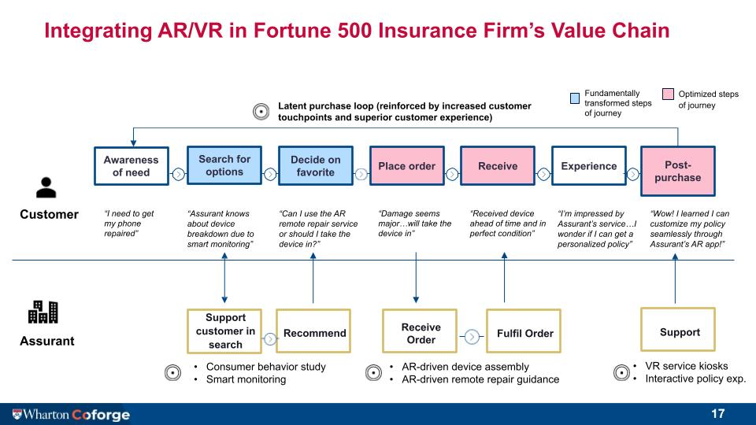

# Data Scientist

### Education

* Masters of Science in Engineering: **Data Science** at the **University of Pennsylvania**

* Bachelors in **Applied Mathematics** and **Economics** at **Colgate University**

### Work Experience

* Incoming Machine Learning Engineer Intern @ **Sisense**

* Data Analyst @ **Unqork**

* Analytics Intern @ **Unqork**

### Projects

**Machine Learning**:
* Adapting Explainability Methods to Image Generation Models
    

Github link: https://github.com/CalebG1/TrustworthyML/blob/main/Automating_SHAP_value_calculation.ipynb

* Explaining Medical Insurance Price Prediction Models

* Workflow Use Case Clustering

**Probability Models**

* Modeling Credit Card Usage using Negative Binomial Distributions
  

* Generative Probability Models Capturing Trends in Ticket Sales of the Movie ‘Wonka’ (2024)

* Decomposing Recent Protests in the US

**Business Strategy in Tech**

* End-to-end business plan for a biodegradable soil sensors
 

* Consulting Fortune 500 Insurance Company on Integrating AR/VR into their Value Chain to Improve Efficiency
 
